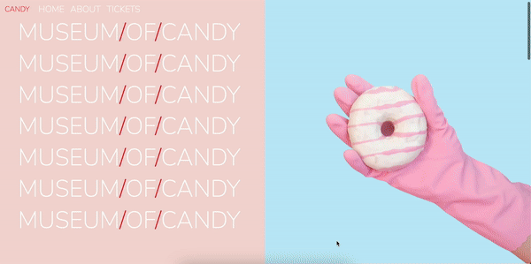

# Museum of Candy

`Museum of Candy` 프로젝트는 사탕 박물관을 주제로 한 웹페이지를 Bootstrap을 활용하여 퍼블리싱 하는 것을 목표로 합니다.

 

## Stack and Tools

 

## Publishing and Design

Bootstrap을 통해 그리드 시스템을 활용하여 레이아웃을 설정하고, 컴포넌트들을 조합하여 모던하고 시각적으로 매력적인 디자인을 완성했습니다.

 

## How to run and Test in local environment

깃 클론 후, `index.html` 파일을 브라우저로 열어 실행합니다.

 

## Preview

### PC version

### Mobile version

